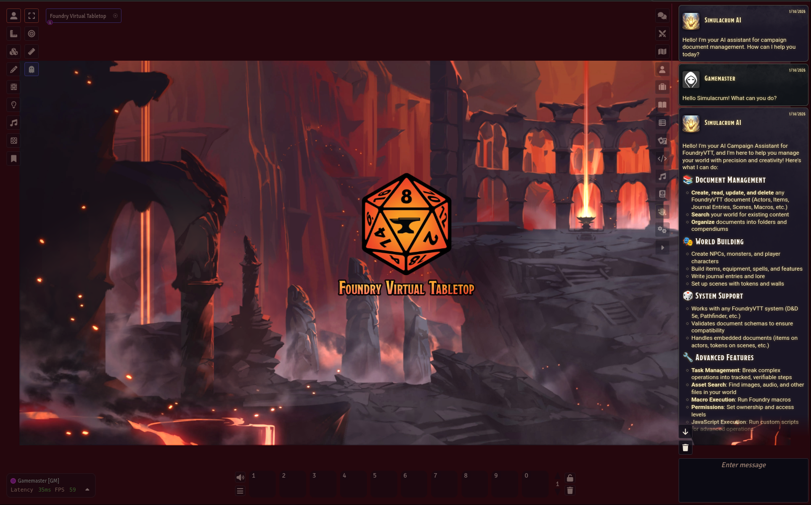

# Simulacrum: AI Campaign Copilot

An AI-powered Campaign Copilot for [Foundry Virtual Tabletop](https://foundryvtt.com/) that helps Game Masters manage their campaigns through natural language conversation.

  

## What is Simulacrum?

Simulacrum is an intelligent agent that lives inside your Foundry VTT sidebar. Unlike simple text generators, Simulacrum is a **Campaign Copilot**—it can understand your requests, plan multi-step operations, and directly interact with your game world.

**Ask it to:**
- Create NPCs, items, journal entries, and other documents
- Search and read existing campaign content
- Update documents with new information
- Execute complex multi-step tasks
- Run custom macros and JavaScript automation

## Features

### Intelligent Document Management
Simulacrum understands Foundry VTT's document structure. Create an actor, and it knows about abilities, items, and system-specific fields. Ask for a magic sword, and it builds one with proper stats.

### Extensible Tool System
The AI uses a set of tools to interact with your world:
- **Document Tools**: Create, read, update, delete, search, and list documents
- **Compendium Tools**: Lock/unlock packs, manage document ownership
- **Asset Search**: Find images, audio, and other assets in your data
- **Schema Introspection**: Understands your game system's data structures
- **Macro Execution**: Run any macro in your world
- **JavaScript Execution**: Advanced automation capabilities

### Tool Permission Controls
Destructive operations (update, delete, macro/JS execution) require confirmation before executing. Configure per-tool permissions with Allow, Deny, Always Allow, or Blacklist options.

### Task Tracking
For complex operations, Simulacrum can create and manage tasks, tracking progress across multiple steps and reporting when complete.

### Multi-Provider Support
Connect to the AI provider of your choice:
- OpenAI (GPT-4, etc.)
- Google Gemini
- Anthropic Claude
- Any OpenAI-compatible API (local models, proxies, etc.)

### GM-Only Access
Simulacrum is restricted to Game Masters only—players cannot access the AI interface or execute commands.

## Installation

### From Foundry VTT
1. Open Foundry VTT and navigate to **Add-on Modules**
2. Click **Install Module**
3. Search for "Simulacrum"
4. Click **Install**

### Manual Installation
1. Download the latest release from [GitHub Releases](https://github.com/Daxiongmao87/simulacrum-foundry/releases)
2. Extract to your `Data/modules/` directory
3. Restart Foundry VTT

## Configuration

1. Enable the module in your world
2. Open **Module Settings** → **Simulacrum**
3. Configure your AI provider and API key
4. Access Simulacrum from the sidebar tab

### Required Settings
- **API Provider**: Select your AI service
- **API Key**: Your provider's API key
- **Model**: The model to use (e.g., `gpt-4o`, `gemini-2.5-flash`, `claude-3.5-sonnet`)

## Usage

Click the Simulacrum tab in the sidebar and start chatting. Examples:

> "Create a goblin warrior named Grunk with 15 HP and a rusty shortsword"

> "Find all journal entries about the Kingdom of Eldoria"

> "Update the Dragon's Lair scene to add a treasure hoard in the corner"

> "Create a task to build out the entire merchant guild, including 5 NPCs and their shop inventory"

## Extending Simulacrum

### Custom Macro Tools
Create macros that Simulacrum can execute as tools. Define a `tool` constant in your macro with name, description, and parameters schema.

### JavaScript Execution
For advanced users, Simulacrum can execute arbitrary JavaScript, enabling complex automation workflows.

## Requirements

- Foundry VTT v13.0.0 or higher
- An AI provider API key with **tool/function calling support**:
  - OpenAI (GPT-4, GPT-4o, etc.)
  - Google Gemini (2.0 Flash, 2.5 Pro, etc.)
  - Anthropic Claude (3.5 Sonnet, etc.)
  - Any OpenAI-compatible API that supports function calling

> **Note**: Your AI endpoint must support OpenAI-style tool/function calling. Simulacrum relies on native tool calling to execute actions reliably. Endpoints that only support text completion are not compatible.

## Support

- **Issues**: [GitHub Issues](https://github.com/Daxiongmao87/simulacrum-foundry/issues)
- **Source**: [GitHub Repository](https://github.com/Daxiongmao87/simulacrum-foundry)
- **Donate**: [Buy Me a Coffee](https://buymeacoffee.com/daxiongmao87)

## License

MIT License - see [LICENSE](LICENSE) for details.

## Credits

Created by [Daxiongmao87](https://github.com/Daxiongmao87)
