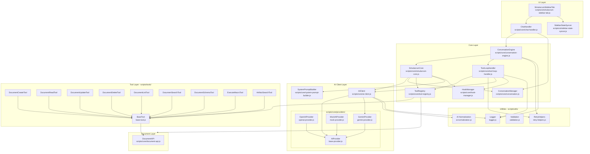
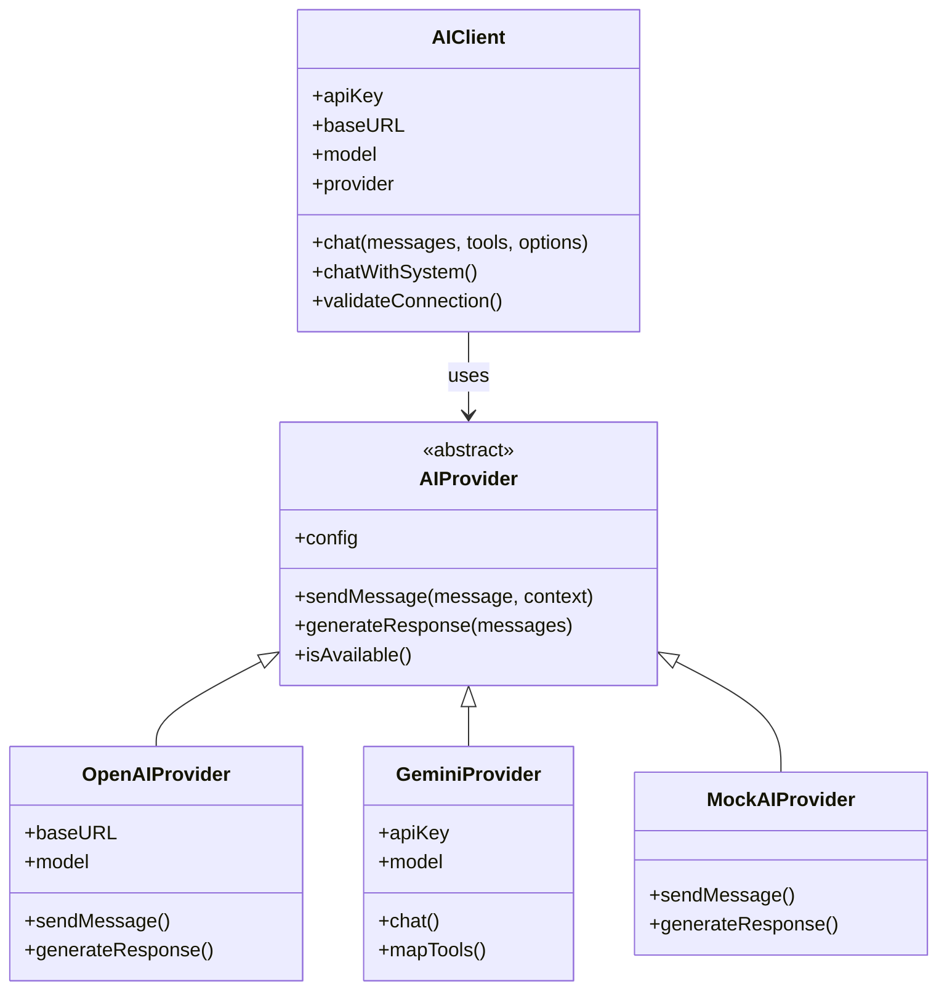
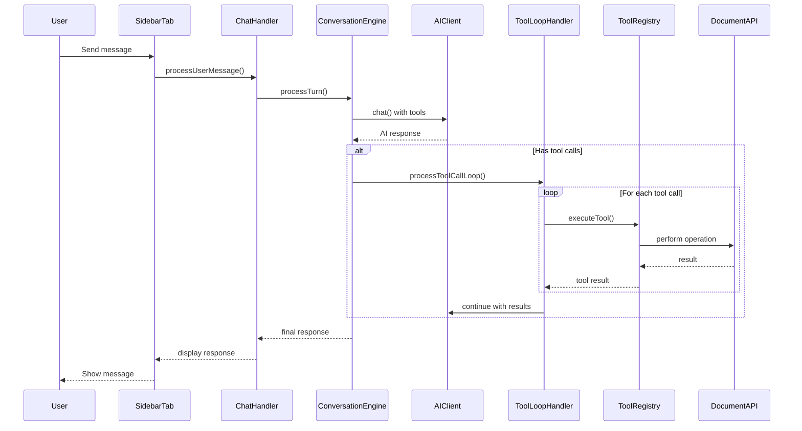

# Simulacrum Architecture Overview

> Last updated: December 2024 (Phase 4 complete)

## System Architecture Diagram

---

## Key Components

### Core Classes

| Class | File | Responsibilities |
|-------|------|------------------|
| `SimulacrumCore` | `scripts/core/simulacrum-core.js` | Main orchestrator, initialization, delegation to managers |
| `AIClient` | `scripts/core/ai-client.js` | AI provider abstraction, request handling |
| `ConversationEngine` | `scripts/core/conversation-engine.js` | Single turn orchestration, retry logic |
| `ToolLoopHandler` | `scripts/core/tool-loop-handler.js` | Tool execution loop, error handling |
| `ConversationManager` | `scripts/core/conversation.js` | Message history, token management, **state persistence** |
| `ToolRegistry` | `scripts/core/tool-registry.js` | Tool registration (**now includes defaults**), schema generation, execution |
| `HookManager` | `scripts/core/hook-manager.js` | Centralized hook constants and emit helpers |
| `DocumentAPI` | `scripts/core/document-api.js` | FoundryVTT document abstraction |
| `ChatHandler` | `scripts/core/chat-handler.js` | Chat flow orchestration |

### Extracted Modules (New)

| Module | File | Extracted From |
|--------|------|----------------|
| `GeminiProvider` | `scripts/core/providers/gemini-provider.js` | ai-client.js |
| `SystemPromptBuilder` | `scripts/core/system-prompt-builder.js` | SimulacrumCore |
| `AIProvider` | `scripts/core/providers/base-provider.js` | ai-client.js |
| `OpenAIProvider` | `scripts/core/providers/openai-provider.js` | ai-client.js |
| `MockAIProvider` | `scripts/core/providers/mock-provider.js` | ai-client.js |
| `RetryHelpers` | `scripts/utils/retry-helpers.js` | conversation-engine.js, tool-loop-handler.js |
| `SidebarStateSyncer` | `scripts/ui/sidebar-state-syncer.js` | simulacrum-sidebar-tab.js |

### Utility Functions

| Function | File | Purpose |
|----------|------|---------|
| `emitProcessStatus()` | hook-manager.js | Emit process status hooks |
| `emitProcessCancelled()` | hook-manager.js | Emit cancellation hooks |
| `isToolCallFailure()` | retry-helpers.js | Check for tool call failures |
| `buildRetryLabel()` | retry-helpers.js | Human-readable retry labels |
| `buildSystemPrompt()` | system-prompt-builder.js | Generate AI system prompt |
| `syncMessagesFromCore()` | sidebar-state-syncer.js | Sync conversation to UI |

---

## AI Provider Architecture

---

## Data Flow

